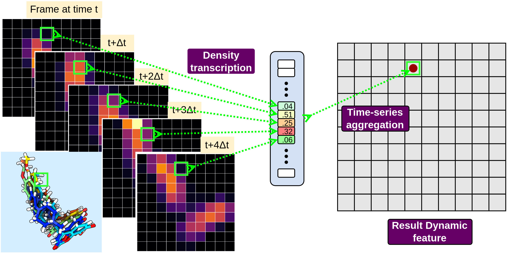
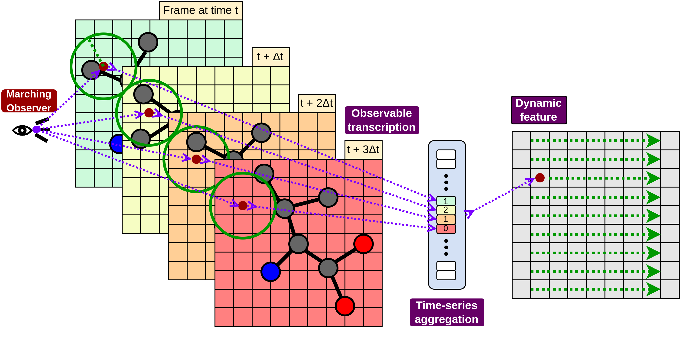

.. _ref_dynamic_features:

Dynamic features
================

A static feature describes a single snapshot: :class:`Mass <nearl.features.Mass>` or
:class:`Aromaticity <nearl.features.Aromaticity>` voxelize one frame and stop there.
A **dynamic feature** describes a *slice* of consecutive frames instead. It transcribes
every frame in the slice onto the grid and then collapses the time axis, so the result
has the same shape as a static feature but carries information about how the system moved.

Nearl provides two of them, and they differ only in what a single frame contributes to the grid:

- :class:`DensityFlow <nearl.features.DensityFlow>` spreads each atom onto the grid as a
  Gaussian, so a frame becomes a density field.
- :class:`MarchingObservers <nearl.features.MarchingObservers>` turns every grid point into
  an observer that reports one measurement about the atoms around it.

The two stages
--------------

Both features run the same pipeline:

1. **Transcription.** Every frame of the slice becomes a ``[D,D,D]`` grid, so a slice of
   ``F`` frames becomes an ``[F,D,D,D]`` tensor.
2. **Aggregation.** At each grid point the ``F`` values form a short time series, which the
   ``agg`` function reduces to a single number. The tensor collapses back to ``[D,D,D]``.

Because the output shape is unchanged, dynamic and static features can be stacked as
channels of the same 3D grid.

The slice length ``F`` is the featurizer's ``time_window``:

.. code-block:: python

  FEATURIZER_PARMS = {
    "dimensions": 32,       # D: the grid is 32 x 32 x 32
    "lengths": 16,          # 16 Angstrom across, so 0.5 A per voxel
    "time_window": 10,      # F: 10 frames are aggregated into one feature
    "sigma": 1.5,
    "cutoff": 3.5,
    "outfile": "/tmp/dynamic_features.h5",
  }

Each trajectory is cut into ``n_frames // time_window`` non-overlapping slices, and every
slice produces one entry per feature. A 101-frame trajectory with ``time_window=10`` yields
10 slices and ignores the last frame, which the featurizer reports as a warning.

.. tip::

  ``weight_type`` is evaluated **once per trajectory** and the resulting per-atom array is
  reused for every frame of every slice; the properties that need geometry (aromaticity,
  hybridization, hydrogen bonding) are perceived from the first frame. Only the coordinates
  change with time. This keeps expensive perception out of the per-frame loop, but it also
  means a dynamic feature tracks the *motion* of a fixed per-atom property rather than a
  property that itself changes over the window.

Anatomy of a dynamic feature
----------------------------

Both features accept the same core arguments:

.. list-table::
  :header-rows: 1
  :widths: 18 82

  * - Argument
    - Meaning
  * - ``selection``
    - Which atoms contribute, as an Amber-style mask (e.g. ``":LIG"``). Atoms outside the
      selection are ignored entirely.
  * - ``weight_type``
    - The per-atom number being transcribed. See `Choosing the weight`_.
  * - ``agg``
    - How the ``F`` per-frame values collapse into one. See `Choosing the aggregation`_.
  * - ``cutoff``
    - For ``DensityFlow``, the radius beyond which an atom stops contributing to a grid point.
      For ``MarchingObservers``, the radius each observer can see.
  * - ``sigma``
    - Width of the Gaussian used by ``DensityFlow``. ``MarchingObservers`` does not use it.
  * - ``obs``
    - ``MarchingObservers`` only: what each observer measures. See `Marching observers`_.
  * - ``outkey``
    - Name of the dataset written into the featurizer's HDF5 output file.

Arguments left unset are inherited from the featurizer when the feature is registered, so
``cutoff``, ``sigma``, ``dimensions``, ``lengths`` and ``outfile`` normally only need to be
given once in ``FEATURIZER_PARMS``.

.. note::

  ``selection`` decides *which atoms* are transcribed; :meth:`register_focus
  <nearl.featurizer.Featurizer.register_focus>` decides *where the box sits*. Selecting the
  pocket while focusing on the ligand is a common and deliberate combination.

Property density flow
---------------------

Each frame is voxelized: every selected atom spreads its weight over the nearby grid points
as a Gaussian of width ``sigma``, truncated at ``cutoff``. Stacking the frames gives a
density field that evolves over the window, and the aggregation asks one question of the
short time series sitting at each grid point.

.. code-block:: python

  import nearl.features

  # Where the ligand's mass sits on average over the window
  nearl.features.DensityFlow(
    selection=":LIG", weight_type="mass", agg="mean", outkey="df_mass_mean"
  )

  # Where that density fluctuates the most: the mobile part of the ligand
  nearl.features.DensityFlow(
    selection=":LIG", weight_type="mass", agg="standard_deviation", outkey="df_mass_std"
  )

  # Where aromatic pocket atoms are systematically moving in or out
  nearl.features.DensityFlow(
    selection="!(:LIG,T3P)", weight_type="aromaticity", agg="drift", outkey="df_arom_drift"
  )

Marching observers
------------------

Rather than spreading atoms onto the grid, every grid point becomes a fixed observer with a
viewing radius of ``cutoff``. In each frame it looks at the selected atoms inside that radius
and reports a single number, chosen with ``obs``. The ``F`` reports are then aggregated like
any other dynamic feature.

.. code-block:: python

  # How crowded each observer is, averaged over the window
  nearl.features.MarchingObservers(
    selection=":LIG", obs="density", weight_type="mass", agg="mean", outkey="obs_density_mean"
  )

  # The largest number of different ligand atoms an observer ever saw
  nearl.features.MarchingObservers(
    selection=":LIG", obs="distinct_count", weight_type="atomic_id", agg="max",
    outkey="obs_distinct_max"
  )

Count-based observables ignore the weight, except ``distinct_count``, which treats it as an
identity:

.. list-table::
  :header-rows: 1
  :widths: 25 75

  * - ``obs``
    - What the observer reports for one frame
  * - ``existence``
    - ``1`` if any atom is within the radius, otherwise ``0``
  * - ``direct_count``
    - How many atoms are within the radius
  * - ``distinct_count``
    - How many *different* weight values are within the radius; pair it with a discrete
      weight such as ``atomic_id`` or ``residue_id``

Weight-based observables use the weight of every atom they see:

.. list-table::
  :header-rows: 1
  :widths: 25 75

  * - ``obs``
    - What the observer reports for one frame
  * - ``mean_distance``
    - Weighted mean distance from the observer to the atoms it sees
  * - ``cumulative_weight``
    - Sum of the weights within the radius
  * - ``density``
    - That sum divided by the volume of the observation sphere
  * - ``dispersion``
    - Weighted mean pairwise distance among the observed atoms
  * - ``eccentricity``
    - Distance from the observer to the weighted centre of mass of what it sees
  * - ``radius_of_gyration``
    - Weighted radius of gyration of the observed atoms

.. note::

  ``distinct_count`` tracks at most 1000 distinct values per observer, and compares
  continuous weights after rounding to one decimal place. Discrete weights avoid both issues.

Choosing the weight
-------------------

The weight is what makes two otherwise identical features describe different chemistry.
These come from the topology alone and cost almost nothing:

.. list-table::
  :header-rows: 1
  :widths: 25 75

  * - ``weight_type``
    - Per-atom value
  * - ``atomic_id``
    - The atom's index; an identity rather than a physical quantity
  * - ``residue_id``
    - The residue index; the same idea at residue granularity
  * - ``atomic_number``
    - The element's atomic number
  * - ``mass``
    - Atomic mass
  * - ``radius``
    - Van der Waals radius (Alvarez, 2013)
  * - ``electronegativity``
    - Pauling electronegativity
  * - ``hydrophobicity``
    - Electronegativity difference from carbon, used as a hydrophobicity proxy
  * - ``uniformed``
    - A constant for every atom, ``1`` by default (pass ``manual_weight`` to change it);
      gives pure occupancy
  * - ``heavy_atom``
    - ``1`` for every non-hydrogen atom
  * - ``backboneness``
    - ``1`` for backbone atoms (``N``, ``CA``, ``C``, ``O``, ``HA``, ``HN``)
  * - ``sidechainness``
    - ``1`` for everything that is not backbone
  * - ``atom_type``
    - ``1`` for atoms of one element; requires ``element_type`` (an atomic number)

These are perceived by OpenBabel. The molecule is built once per trajectory and shared by
every feature that needs it, so asking for several of them is cheap:

.. list-table::
  :header-rows: 1
  :widths: 25 75

  * - ``weight_type``
    - Per-atom value
  * - ``aromaticity``
    - ``1`` for aromatic atoms
  * - ``ring``
    - ``1`` for atoms in a ring
  * - ``hybridization``
    - Hybridization state as an integer (1 = sp, 2 = sp2, 3 = sp3)
  * - ``hbond_donor``
    - ``1`` for hydrogen-bond donors
  * - ``hbond_acceptor``
    - ``1`` for hydrogen-bond acceptors

``partial_charge`` is the remaining option, and the only one with a caveat in both
directions.

.. warning::

  As a dynamic weight, ``partial_charge`` always reads the charges carried by the topology,
  with both signs kept: the ``charge_type`` and ``keep_sign`` arguments of
  :class:`PartialCharge <nearl.features.PartialCharge>` are not forwarded through
  ``weight_type``. A topology without charges (a PDB, for instance) therefore has nothing to
  offer here, and where charges do exist, positive and negative contributions cancel when
  they land on the same grid point. Register a standalone
  :class:`PartialCharge <nearl.features.PartialCharge>` feature when a specific charge source
  (such as `ChargeFW2 <https://github.com/sb-ncbr/ChargeFW2>`_) or a single polarity
  is needed.

.. code-block:: python

  # Count carbons only
  nearl.features.DensityFlow(
    selection=":LIG", weight_type="atom_type", element_type=6, agg="mean", outkey="df_carbon"
  )

  # Give every atom the same weight of 2.5
  nearl.features.MarchingObservers(
    selection=":LIG", obs="existence", weight_type="uniformed", manual_weight=2.5,
    agg="mean", outkey="obs_occupancy"
  )

Choosing the aggregation
------------------------

The aggregation turns the ``F`` values at a grid point into the number that is finally stored.

.. list-table::
  :header-rows: 1
  :widths: 25 75

  * - ``agg``
    - Reduction over the time window
  * - ``mean``
    - Average value; where the property sits over the window
  * - ``standard_deviation``
    - Spread around that average; where the property fluctuates
  * - ``variance``
    - The squared spread
  * - ``median``
    - Middle value, less sensitive to a single outlying frame
  * - ``max``
    - Largest value seen in the window
  * - ``min``
    - Smallest value seen in the window
  * - ``information_entropy``
    - Shannon entropy of a 16-bin histogram of the values; how varied the series is
  * - ``drift``
    - Slope of a least-squares line through the series; a systematic trend rather than noise

``mean`` and ``standard_deviation`` answer "where" and "how mobile". ``drift`` answers
"in which direction", and is the one aggregation that distinguishes a steady approach from a
symmetric wobble of the same amplitude.

Put it together
---------------

The following script registers both dynamic features with several weights and aggregations,
runs the featurization and prints what landed in the output file.

.. literalinclude:: _static/dynamic_features.py
  :language: python

Running it produces one entry per frame slice for every feature:

.. code-block:: text

  outkey                             shape       min       max
  df_arom_mean            (10, 32, 32, 32)     0.000     0.010
  df_mass_mean            (10, 32, 32, 32)     0.000     0.183
  df_mass_std             (10, 32, 32, 32)     0.000     0.066
  obs_density_mean        (10, 32, 32, 32)     0.000     0.944
  obs_distinct_max        (10, 32, 32, 32)     0.000    23.000
  obs_rog_drift           (10, 32, 32, 32)    -0.412     0.430

The leading dimension is the number of frame slices, and ``obs_rog_drift`` is negative
wherever the observed pocket atoms closed in over the window. See :doc:`intro_visual` for
ways to inspect the resulting grids.

.. note::

  :download:`Download Python source code for local execution <_static/dynamic_features.py>`

Limits to keep in mind
----------------------

- The CUDA kernels aggregate at most **512 frames**, so a ``time_window`` above that silently
  contributes only the first 512 frames of each slice. The featurizer warns when this happens.
- At most **9999 atoms** per frame are carried into the box; a denser selection is truncated
  with a warning. Excluding solvent (``mask="!:T3P"`` on the loader, or a ``selection`` that
  omits it) is the usual remedy.
- A slice in which no selected atom falls inside the box produces zeros, which the featurizer
  reports in verbose mode. Check the focus definition if a feature comes out empty.
