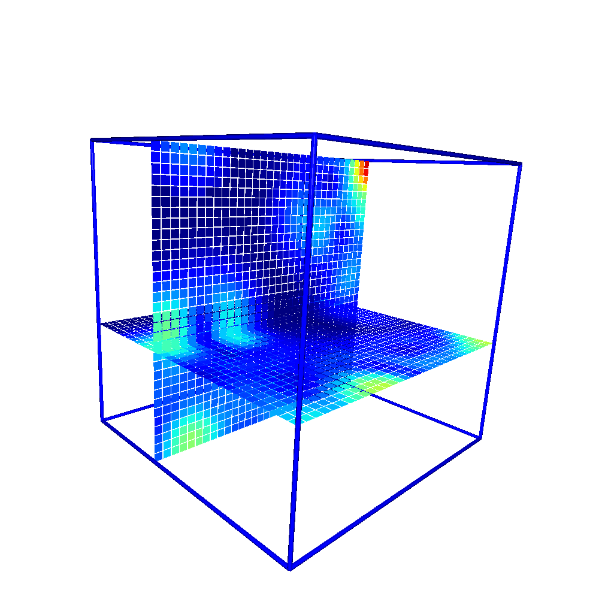
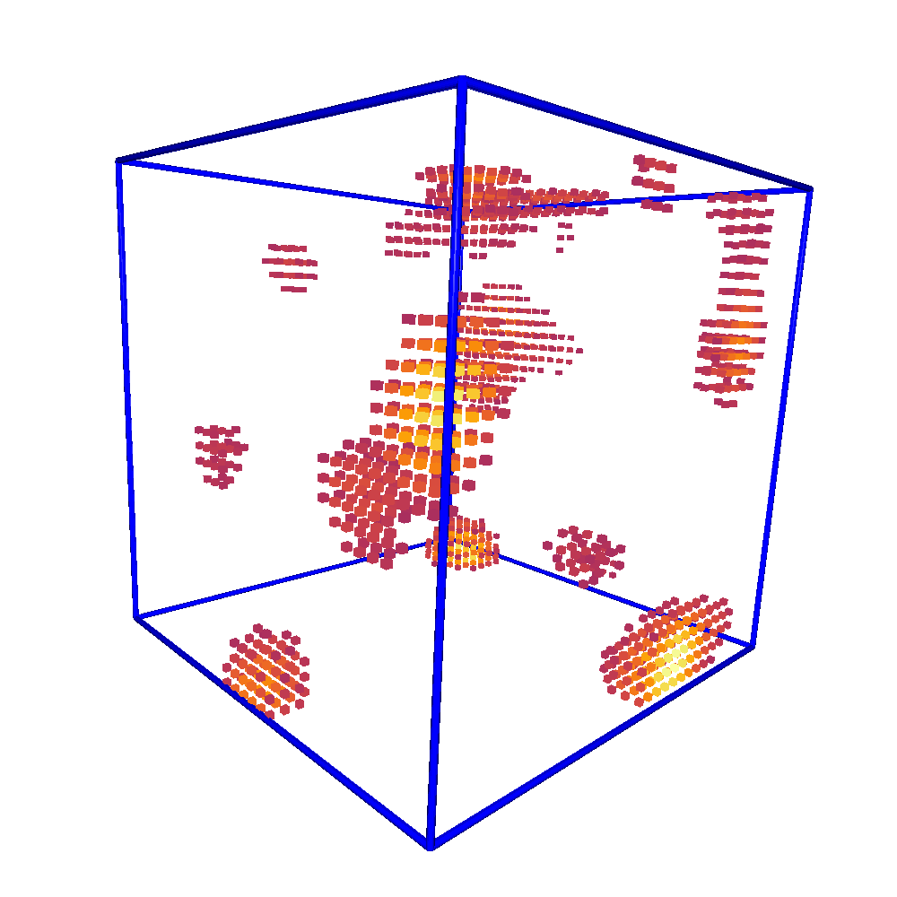

Visualize the features
======================

Several command line interfaces (CLI) are provided to perform visual inspection on the 3D-voxel features.

View slices of the voxel
------------------------

.. code-block:: bash

  $ nearl-view-slice --help
  usage: View the slice of the voxel for each axes [-h] [-f FILEINPUT] [-i INDEX] [-t TAGNAME] [-c CMAP] [-b BOUNDINGBOX] [-x X] [-y Y] [-z Z]

  optional arguments:
    -h, --help            show this help message and exit
    -f FILEINPUT, --fileinput FILEINPUT
                          The input HDF5 file
    -i INDEX, --index INDEX
                          The index of the molecule to be viewed, default: 0
    -t TAGNAME, --tagname TAGNAME
                          The tag name of the voxel, default: voxel
    -c CMAP, --cmap CMAP  The colormap to be used, default: inferno
    -b BOUNDINGBOX, --boundingbox BOUNDINGBOX
                          Whether or not to add a bounding box of the voxel. Default: 1
    -s SAVEPLY, --saveply SAVEPLY
                          The output file to save the ply object
    -x X, --x X           The x slice to be viewed, default: -1 (hide)
    -y Y, --y Y           The y slice to be viewed, default: 15
    -z Z, --z Z           The z slice to be viewed, default: 15

  $ nearl-view-slice -f /tmp/features.h5 -t df_mass_std_prot -z 4 -b 0 -c jet -s /tmp/test.ply  

With the above command, an `Open3D viewer <https://www.open3d.org/docs/release/tutorial/visualization/customized_visualization.html>`_ will be opened to visualize the voxelized feature of the 3D voxel.

.. code-block:: bash

  # Visualize voxelized feature of the 3D voxel.
  
  

View grid of the voxel
----------------------

.. code-block:: bash

  $ nearl-view-voxel --help
  usage: View 3D voxels  [-h] [-f FILEINPUT] [-i INDEX] [-t TAGNAME] [-c CMAP] [-p PERCENTILE] [--hide HIDE] [-b BOUNDINGBOX]

  optional arguments:
    -h, --help            show this help message and exit
    -f FILEINPUT, --fileinput FILEINPUT
                          The input HDF5 file
    -i INDEX, --index INDEX
                          The index of the molecule to be viewed, default: 0
    -t TAGNAME, --tagname TAGNAME
                          The tag name of the voxel, default: voxel
    -c CMAP, --cmap CMAP  The colormap to be used, default: inferno
    -p PERCENTILE, --percentile PERCENTILE
                          The percentile to be used for the cutoff, default: 95
    --hide HIDE           Whether or not to hide the zero voxels, default: 1
    -b BOUNDINGBOX, --boundingbox BOUNDINGBOX
                          Whether or not to add a bounding box of the voxel. Default: 1

